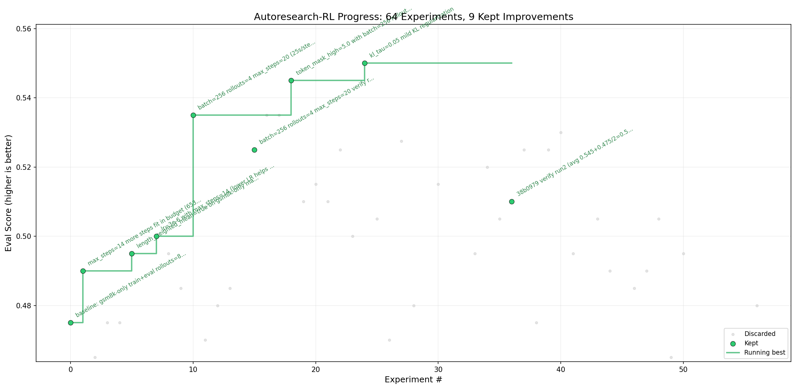

# autoresearch-rl

If you've ever tried RL post-training, you know the pain. You tweak the learning rate, kick off a run, wait 20 minutes, check the eval, see it collapsed, roll back, try something else. Repeat until you lose your mind or your GPU reservation expires. The whole thing is fragile, a slightly wrong clipping ratio or one bad KL penalty and your model forgets how to write coherent sentences. It's not like pretraining where you can kind of set it and forget it. RL is just... unstable by nature.

So when I saw Andrej Karpathy's [autoresearch](https://github.com/karpathy/autoresearch), where he let an AI agent autonomously run pretraining experiments overnight, the first thing that came to mind was: why not do this for RL post-training? That's where the real pain is. That's where you actually need the help.

That's what this is. You point an AI agent at a real RL training setup, go to sleep, and wake up to a log of 60+ experiments it ran while you were gone. Each one modifies the config, trains for 10 minutes, checks if evals improved, keeps or discards, and moves on to the next idea. No babysitting. No manual hyperparameter sweeps. Just let it cook.

Built on [prime-rl](https://github.com/PrimeIntellect-ai/prime-rl), honestly my favourite RL post-training framework out there, and [verifiers](https://github.com/PrimeIntellect-ai/verifiers) for reward verification.

Shoutout to [@willccbb](https://x.com/willccbb) for creating verifiers and making it opensource.

## Progress



## How it works

The repo has four files that matter:

- **`prepare.py`** - fixed constants, one-time setup (downloads base model, verifies GPUs). Not modified.
- **`train.toml`** - the single file the agent edits. Contains the full RL training configuration: optimizer, learning rate, loss function, environments, rollout settings, etc. **This file is edited and iterated on by the agent**.
- **`run.py`** - experiment runner. Launches prime-rl, enforces the time budget, extracts metrics. Not modified.
- **`program.md`** - instructions for the agent. **This file is edited and iterated on by the human**.

By design, training runs for a **fixed 10-minute time budget**. The metric is **eval_score** (average pass@1 across environments), higher is better.

## Quick start

**Requirements:** 2 NVIDIA GPUs, Python 3.12+, [uv](https://docs.astral.sh/uv/).

```bash
# 1. Install uv (if you don't already have it)
curl -LsSf https://astral.sh/uv/install.sh | sh

# 2. Install dependencies
uv sync

# 3. One-time setup (download model, verify GPUs)
uv run prepare.py

# 4. Run a single experiment (~12 min)
uv run run.py
```

## Running the agent

Spin up Claude/Codex in this repo, then prompt:

```
Hi have a look at program.md and let's kick off a new experiment! let's do the setup first.
```

## Design choices

- **Single file to modify.** The agent only touches `train.toml`. Diffs are easy to review.
- **Fixed time budget.** Training always runs for 10 minutes, making experiments directly comparable.
- **2-GPU setup.** GPU 0 runs vLLM inference, GPU 1 runs the RL trainer. No memory contention.
- **Multiple environments.** GSM8K by default. Composite metric prevents overfitting to one task.
- **Built on prime-rl.** Production-ready async RL framework with GRPO/IPO/DPPO support.

## Best configuration found

After 66 experiments, the agent converged on this config (`train.toml`), going from a baseline of **0.475** to **0.550** eval_score on GSM8K (pass@1):

| Parameter | Value | Why it matters |
|-----------|-------|----------------|
| `lr` | `3e-6` | Lower than the initial 5e-6, prevents overfitting over 20 steps |
| `batch_size` | `256` | Smaller batches = more gradient updates in the same time budget |
| `rollouts_per_example` | `4` | Fewer rollouts per example, but more steps overall |
| `max_steps` | `20` | Sweet spot, 14 was too few, 24 overfits |
| `token_mask_high` | `5.0` | Clips extreme importance ratios at the token level |
| `length_weighted_mean` | `true` | Normalizes loss by response length, helps with variable-length outputs |
| `scheduler` | `constant` | No warmup, no decay, just constant LR for 20 steps |
| `optimizer` | `adamw` | Default, but confirmed better than SGD and Muon |
| `temperature` | `1.0` | Default sampling temp, 0.7 and 1.2 both hurt |

Key things that didn't work: LoRA (rank 16), cosine/linear schedules, higher LR (5e-6+), rollouts=8 (no gain over 4), difficulty filtering, repetition penalty, and torch.compile.

## License

MIT
